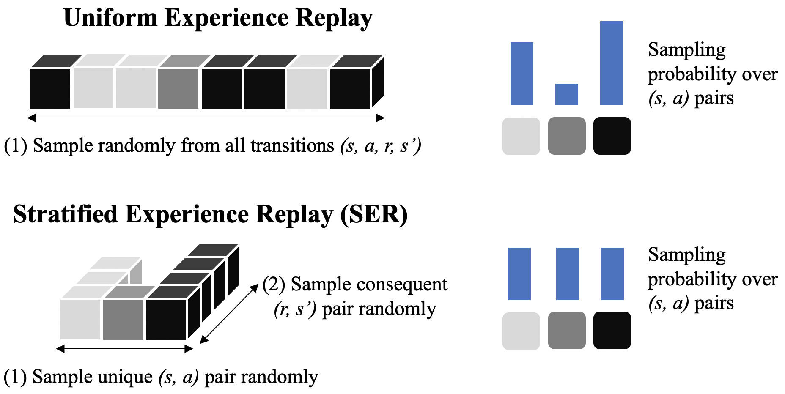

# Stratified Experience Replay

This repository contains the experiment code for the extended abstract
[Stratified Experience Replay: Correcting Multiplicity Bias in Off-Policy Deep Reinforcement Learning](https://arxiv.org/pdf/2102.11319.pdf), presented at AAMAS 2021.

Stratified Experience Replay (SER) is an alternative sampling technique for off-policy deep reinforcement learning methods—such as Deep Q-Network (DQN).
While it is commonly believed that sampling from a uniform distribution over the replay memory decorrelates training data, these samples are still subject to underlying correlations caused by the environment's transition dynamics and the agent's policy.
In other words, state-action pairs that are visited more frequently in the environment will also be replayed more frequently during training.
We call this _multiplicity bias_.

SER attempts to counteract this bias by sampling frequent experiences less often and rare experiences more often.
More specifically, it ensures that (under certain assumptions) each state-action pair is sampled equally often on average:



SER can be efficiently implemented using a hybrid data structure that consists of an array and a hash table.
See [replay_memory.py](dqn_utils/replay_memory.py) for our Python/NumPy implementation.

If you want to cite this code in published work, please cite the extended abstract:

```
@inproceedings{daley2021stratified,
  title={Stratified Experience Replay: Correcting Multiplicity Bias in Off-Policy Reinforcement Learning},
  author={Daley, Brett and Hickert, Cameron and Amato, Christopher},
  booktitle={Proceedings of the 20th International Conference on Autonomous Agents and MultiAgent Systems},
  pages={1486--1488},
  year={2021}
}
```

## Installation

This repository requires Python 3.
Clone the repository and install the required packages with pip:

```
git clone https://github.com/brett-daley/stratified-experience-replay.git
cd stratified-experience-replay
pip install -r requirements.txt
```

Experiments can be executed by calling the main script ([dqn.py](dqn.py)).
In general, you should specify an environment, a replay memory, and a random seed.
The environment can be either an [OpenAI Gym ID](https://gym.openai.com/envs/) or an Atari game.
For example:

`python dqn.py --env Taxi-v3 --rmem_type StratifiedReplayMemory --seed 0`

`python dqn.py --env pong --rmem_type ReplayMemory --seed 0`

Run `python dqn.py -h` for additional argument info.

>To get a list of the Atari game names, run these commands in Python:
>```python
>import atari_py
>print(sorted(atari_py.list_games()))
>```

## Extended Abstract Experiment Details

We had to omit many important experiment details (such as [hyperparameters](dqn_utils/hparams.py)) from the extended abstract due to the 2-page limit.
We have included them here in this README in the interest of reproducibility.

### Toy text environments (Figure 2)

We compared SER against uniform ER by training DQN on two toy text environments from OpenAI Gym:
`FrozenLake-v0` and `Taxi-v3`.
The Q-network was a 2-layer tanh network with 512 hidden units in both layers.
The network was trained using Adam with a learning rate of 1e-4 and an denominator constant of 1e-4.

We prepopulated the replay memories with 50,000 experiences collected from the random policy.
The agents executed an ε-greedy policy where ε was annealed from 1.0 to 0.1 over 500,000 timesteps and then held constant.

We trained the agents for 2 million timesteps each, averaged over 100 trials (seeds 0-99).
The experiments can be reproduced by running the following command (change the arguments as necessary):

`python dqn.py --env FrozenLake-v0 --rmem_type StratifiedReplayMemory --timesteps 2_000_000 --seed 0`

We reported the 100-episode moving average of the undiscounted return (i.e. total episode reward).

#### Normalized Coordinate States

For both Taxi and FrozenLake, the states are uniquely encoded as integers by default.
While this is useful for tabular learning, it prevents generalization when using a neural network and makes learning difficult.
To resolve this, we wrote [environment wrappers](dqn_utils/envs/toytext_env.py) that automatically map these integers into appropriate representations for deep learning.

For FrozenLake, we assign a coordinate (x,y) to each cell in the 4x4 grid, where (0,0) represents the top-left cell and (1,1) represents the bottom-right cell.
A displacement of 1 cell is therefore equivalent to 1/3 units.
The environment state is a 2-dimensional vector of the agent's coordinates.

For Taxi, we did the same conversion for the 5x5 grid (1 cell = 1/4 units).
The environment state becomes a 7-dimensional vector:
- Taxi coordinates. (2)
- Passenger pickup coordinates. (2)
- Passenger destination coordinates. (2)
- One-hot value indicating whether the passenger has been picked up by the taxi: 1 if yes, 0 if no. (1)

### Atari 2600 games (Figure 3)

We also compared SER and uniform ER on 11 Atari 2600 games by training DQN.
Our implementation closely followed that of the original DQN paper (Mnih et al. 2015).
We trained the same 5-layer convolutional network on 84x84 grayscale images.
Our experiments had only three notable differences:
1. We prepopulated the replay memory with 250,000 random-policy samples (instead of 50,000).
1. The ε-greedy policy used a constant value of 0.1 (to better reveal the learning progress of the agent).
1. The network was trained using Adam (learning rate 1e-4, denominator constant 1e-4) instead of RMSProp.

We trained the agents for 10 million timesteps each, averaged over 5 trials (seeds 0-4).
The experiments can be reproduced by running the following command (change the arguments as necessary):

`python dqn.py --env pong --rmem_type StratifiedReplayMemory --timesteps 10_000_000 --seed 0`

We reported the 100-episode moving average of the game score (i.e. total episode reward).
